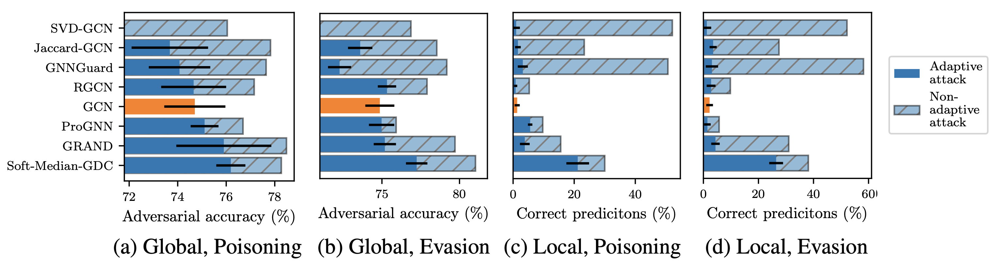

# Are Defenses for Graph Neural Networks Robust?

This is the Python 3.9 code we have used to study the adversarial robustness of
various GNN defenses in our NeurIPS 2022 paper "Are Defenses for Graph Neural
Networks Robust?".

A cursory reading of the literature suggests that we have made a lot of progress
in designing effective adversarial defenses for Graph Neural Networks (GNNs).
Yet, the standard methodology has a serious flaw – virtually all of the defenses
are evaluated against non-adaptive attacks leading to overly optimistic
robustness estimates. We perform a thorough robustness analysis of 7 of the most
popular defenses spanning the entire spectrum of strategies, i.e., aimed at
improving the graph, the architecture, or the training. The results are sobering
– most defenses show no or only marginal improvement compared to an undefended
baseline. We advocate using custom adaptive attacks as a gold standard and we
outline the lessons we learned from successfully designing such attacks.
Moreover, our diverse collection of perturbed graphs forms a (black-box) unit
test offering a first glance at a model's robustness.

- To introduce yourself to the various parts of the code, take a look at the
  demo notebook in [`notebooks/demo.ipynb`](notebooks/demo.ipynb).
- If you are looking for the black-box robustness unit test, you can find a
  self-explanatory demo script in [`unit_test/sketch.py`](unit_test/sketch.py).

## Setup

To install all required dependencies, run the script `requirements-install.sh`.
If you are using a non-Unix machine, run these commands manually instead:

    $ pip install -r requirements-torch.txt -f "https://download.pytorch.org/whl/<PLATFORM>/torch_stable.html"
    $ pip install -r requirements.txt

## Code Organization

- `data/` – The versions of the Cora ML and Citeseer datasets used by us.
- `gb/` – The main codebase. Contains both experiment code and analysis tools.
- `ex_config/` – Configurations to reproduce our experiments. See the next
  section for details.
- `ex_*.py` – Entry points for the experiments configured in `ex_config/`.
- `notebooks/` – The Jupyter notebooks mentioned in this readme file.
- `unit_test/` – The best perturbations per model that we transfer to other
  defenses in Fig. 7, as well as a self-explanatory script sketching how to use
  them to perform a black-box robustness unit test on any defense.

## Reproducing the Experiments

We use Sacred and run the experiments on our internal Slurm cluster and use
MongoDB to keep track of the experiments via the SEML library. The folder
`ex_config/` contains the SEML configurations to reproduce every single attack
we have run.

Depending on the SEML and Sacred settings, resources like data might not be
available at runtime. To remedy this, manually make a copy of this source folder
available on each worker machine and point the variable `FALLBACK_SRC_PATH` in
`gb/util.py` to it.

The `evasion_*.yml` experiments – which actually also include meta attacks for
technical reasons – need to be run first. Note, however, that some of these
attacks require the output of other attacks, which they use as their
initialization. Currently, the corresponding run IDs are substituted with `TODO`
in the `ex_config/` files. Hence, the experiments must be executed in order, and
you need to manually insert the run IDs once they are available. You can obtain
the run IDs using the MongoDB queries referenced in the configuration files
directly above the `TODO` substitutes.

As soon as all "evasion" experiments are finished, you need to use the MongoDB
queries cited in `trans_poisoning.yml` to obtain and insert all evasion
experiment run IDs. Then, start off those experiments as well.

Finally, run the `cross_model_*.yml` experiments to transfer perturbations
between models.

Next, utilize the notebook `data_extraction.ipynb` to download all experiment
results from MongoDB and extract useful information from them in the form of
long strings. These strings you then paste into `paper_plots.ipynb` at the
appropriate locations to reproduce the exact plots we present in our paper and
the appendix.

Note, however, that – while possible – reproducing *all* experiments takes a
considerable amount of time (see also §5 in the paper).
